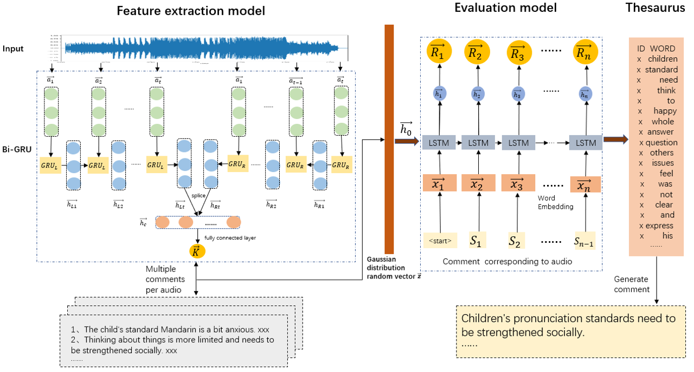

# *Neural Audio Caption Model*

This repo contains PyTorch code for paper: 
"Generative Adversarial Network Based Neural Audio Caption Model for Oral Evaluation"

This  model is based on the neural audio caption method. The basic idea of the model is: read the audio MFCC feature sequence and encode it into a fifixed-length vector, then decode the fifixed-length vector and output the predicted evaluation. 




## Requirements

* anaconda3 (based on Python 3.7)

* PyTorch 1.3.1

* cuDNN V7.0

* CUDA V10.1

* numpy V1.16.5

* python-speech-features V0.6

* jieba V0.39   


## Usage


### Training:

* STEP 1. Prepare the training data
  
  copy `Dataset/*.wav` to `data/audio`.
  
  copy `Dataset/comments.txt` to `data/comment`

* STEP 2. Run `build_vocab.py` to make vocabulary 

```
#python3 build_vocab.py
```

* STEP 3. Adjust hyperparameters in `train.py` if necessary.


* STEP 4. Train the model

```
#python3 train.py
```


### Testing with pre-trained models:

run `sample.py` for testing:

```
python3 sample.py
```

